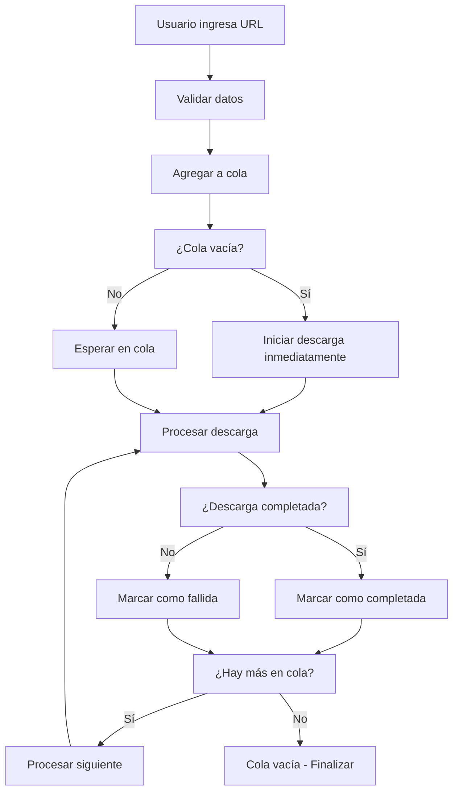

# Sistema de Cola de Descargas - VimeoDownloader

Este documento explica el funcionamiento completo del sistema de cola de descargas implementado en VimeoDownloader.

## 📋 Descripción General

El sistema de cola permite al usuario agregar múltiples descargas que se procesarán **secuencialmente** (una por una), no en paralelo. Esto evita sobrecargar el sistema y permite un mejor control del proceso de descarga.

## 🏗️ Arquitectura del Sistema

### Componentes Principales

#### 1. **DownloadItem** (`downloaditem.h`)
Estructura que representa cada descarga individual:

```cpp
struct DownloadItem {
    QString url;                    // URL del video
    QString username;               // Usuario de Vimeo
    QString password;               // Contraseña de Vimeo
    QString downloadDir;            // Directorio de descarga
    QString title;                  // Título del video (extraído automáticamente)
    DownloadStatus status;          // Estado actual
    QDateTime addedTime;            // Cuándo se agregó a la cola
    QDateTime startTime;            // Cuándo comenzó la descarga
    QDateTime finishTime;           // Cuándo terminó la descarga
    int progress;                   // Progreso de descarga (0-100)
    QString errorMessage;           // Mensaje de error si falla
};
```

**Estados posibles:**
- `Pending`: En cola, esperando ser procesada
- `Downloading`: Descargándose actualmente
- `Completed`: Descarga completada exitosamente
- `Failed`: Descarga falló
- `Cancelled`: Descarga cancelada

#### 2. **DownloadQueue** (`downloadqueue.h/cpp`)
Clase principal que maneja toda la lógica de la cola:

**Características principales:**
- **Cola FIFO**: First In, First Out (primero en entrar, primero en salir)
- **Procesamiento secuencial**: Solo una descarga a la vez
- **Thread-safe**: Usa `QMutex` para operaciones seguras
- **Auto-inicio**: Comienza automáticamente al agregar elementos
- **Gestión de recursos**: Limpia procesos automáticamente

#### 3. **MainWindow** (Integración UI)
Interfaz de usuario que interactúa con la cola:
- **Validación**: Verifica credenciales, directorio y herramientas
- **Feedback visual**: Actualiza contadores y botones
- **Control**: Permite cancelar toda la cola

## 🎯 Funcionamiento del Sistema

### Flujo de Trabajo



### Contador de Progreso

El sistema mantiene un contador persistente en formato `(actual/total)`:

#### Ejemplos de Funcionamiento:

1. **Inicio de aplicación:**
   ```
   Progress (0/0)
   ```

2. **Primera descarga agregada:**
   ```
   Progress (1/1)  // Descargando video 1 de 1 total
   ```

3. **Segunda descarga agregada durante la primera:**
   ```
   Progress (1/2)  // Descargando video 1 de 2 total
   ```

4. **Primera descarga completa:**
   ```
   Progress (2/2)  // Descargando video 2 de 2 total
   ```

5. **Todas las descargas completas:**
   ```
   Progress (2/2)  // 2 descargas completadas de 2 total
   ```

6. **Tercera descarga agregada:**
   ```
   Progress (2/3)  // Descargando video 3, ya completadas 2
   ```

#### Lógica del Contador:
- **Número izquierdo**: Descargas completadas + (1 si hay descarga activa)
- **Número derecho**: Total de descargas agregadas en la sesión
- **Persistencia**: Los contadores NO se reinician hasta cerrar la app o cancelar

## 🎮 Controles de Usuario

### Botón "Download"
- **Función**: Agrega la URL actual a la cola
- **Comportamiento**: 
  - Se deshabilita durante descargas activas
  - Limpia el campo URL después de agregar
  - Valida todos los requisitos antes de agregar

### Botón "Cancel"
- **Ubicación**: Alineado a la derecha de la barra de progreso
- **Visibilidad**: Siempre visible desde el inicio de la aplicación
- **Función**: Cancela toda la cola y resetea contadores a (0/0)
- **Comportamiento**:
  - Mata el proceso actual si está ejecutándose
  - Limpia toda la cola pendiente
  - Resetea todos los contadores
  - Mantiene el mismo color que otros botones de la aplicación

## 🔧 Características Técnicas

### Thread Safety
- **QMutex**: Protege el acceso a la cola
- **Señales Qt**: Comunicación thread-safe entre componentes
- **Atomic operations**: Operaciones atómicas para contadores

### Gestión de Memoria
- **Auto-cleanup**: Los procesos se limpian automáticamente
- **Smart pointers**: Uso de `deleteLater()` para limpieza segura
- **Resource management**: Liberación automática de recursos

### Manejo de Errores
- **Timeout handling**: Manejo de timeouts en procesos
- **Network errors**: Captura errores de red
- **Process crashes**: Detección y manejo de crashes
- **User feedback**: Mensajes informativos en el log

## 📊 Estados del Sistema

### Estados de la Cola
- **Vacía**: No hay descargas pendientes ni activas
- **Activa**: Hay una descarga en progreso
- **En espera**: Hay descargas pendientes en cola
- **Pausada**: Cola pausada (funcionalidad disponible pero no usada en UI)

### Estados de Descarga Individual
Cada `DownloadItem` pasa por estos estados:
1. **Pending** → Se agrega a la cola
2. **Downloading** → Comienza el proceso yt-dlp
3. **Completed/Failed/Cancelled** → Estado final

## 🚀 Ventajas del Sistema

### Para el Usuario
- **Simplicidad**: Solo agregar URLs, el sistema maneja todo
- **Feedback visual**: Siempre sabe cuántas descargas ha hecho
- **Control total**: Puede cancelar todo en cualquier momento
- **No bloqueo**: Puede seguir agregando mientras descarga
- **Interfaz consistente**: Barra de progreso siempre visible, botón Cancel siempre accesible

### Para el Sistema
- **Eficiencia**: Una descarga a la vez evita saturación
- **Estabilidad**: Manejo robusto de errores y recursos
- **Escalabilidad**: Fácil agregar más funcionalidades
- **Mantenibilidad**: Código modular y bien estructurado

## 🔍 Logging y Debugging

El sistema proporciona logging detallado:

```
=== Download Added to Queue ===
URL: https://vimeo.com/123456789
Queue position: 1 of 1
---
=== Starting Download Queue ===
=== Starting Download 1 of 1 ===
URL: https://vimeo.com/123456789
User: usuario@ejemplo.com
Download Folder: /Users/usuario/Downloads
---
Executing: yt-dlp -u usuario@ejemplo.com -p *** --output /Users/usuario/Downloads/%(title)s.%(ext)s --format best https://vimeo.com/123456789
[download] Destination: /Users/usuario/Downloads/Video Title.mp4
[download]   0.0% of 50.25MiB at  Unknown B/s ETA Unknown
[download]  10.5% of 50.25MiB at 2.15MiB/s ETA 00:19
...
[download] 100% of 50.25MiB in 00:23
=== Download completed successfully ===
=== All Downloads Completed ===
Total downloads processed: 1
```

## 🛠️ Configuración y Personalización

### Parámetros Configurables
- **Timeout de inicio**: 5 segundos para iniciar yt-dlp
- **Delay entre descargas**: 1 segundo entre descargas consecutivas
- **Timeout de cancelación**: 3 segundos para matar procesos
- **Ancho de botones**: 100px (consistente con botón Download)

### Extensibilidad
El sistema está diseñado para ser fácilmente extensible:
- **Nuevos estados**: Agregar más estados a `DownloadStatus`
- **Más controles**: Pausar/reanudar cola individual
- **Prioridades**: Sistema de prioridades para descargas
- **Scheduling**: Programar descargas para más tarde

## 📝 Notas de Implementación

### Decisiones de Diseño
1. **Secuencial vs Paralelo**: Se eligió secuencial para evitar saturar yt-dlp y el sistema
2. **Contador persistente**: Los usuarios quieren saber cuánto han descargado en la sesión
3. **Auto-inicio**: Mejor UX que requerir botón "Start Queue"
4. **Cancel todo**: Más simple que cancelar descargas individuales

### Limitaciones Actuales
- No hay persistencia entre sesiones (se pierde al cerrar la app)
- No hay control granular (pausar/reanudar descargas individuales)
- No hay estimación de tiempo total de cola
- No hay preview de lo que está en cola

### Futuras Mejoras Posibles
- **Vista de cola**: Lista de descargas pendientes
- **Persistencia**: Guardar cola al cerrar la app
- **Prioridades**: Reordenar descargas en cola
- **Batch operations**: Agregar múltiples URLs de una vez
- **Progress total**: Progreso combinado de toda la cola
